# Asynchronous processing using AWS Lambda and .Net Core
As our applications grow bigger and get more complex, we usually want to distribute the workload and decouple involved processes. Why? Usually we have an app that faces users and should always be available. Any speed degradation or errors are usually unwanted.

To avoid speed degradations, we can either scale our resources which raises the costs or we can try to offload some resource-consuming processes. Also, if we decouple these processes, we can independently develop and scale them without jeopardizing our main app.

For example, user requests new password via e-mail. Our process can look like this:
- Http request to our app
- app prepares new e-mail
- app sends e-mail
- Http response - Email sent

This looks good, but what if sending e-mail lasts for 10 seconds? Will our user stare at loader icon? What if sending e-mail breaks due to outage that lasted only couple of seconds?

Better way would be to separate this process from rest of the app:
- Http request to our app
- app prepares new e-mail
- app adds new e-mail to mailing queue
- Http response - Email will be sent in couple of moments

Separate process will actually send this e-mail and retry it if needed. This way, we get better user experience and our main app does less work and is easier to maintain.

There are a lot of other use cases like batch operations or image resizing - but that is only a matter of implementation. First you need to know the basics and than build more complex functions.

This guide will cover every part needed to get you going with your first Lambda function which reads messages sent to queue.

## Requirements
In this guide, I'll use Visual Studio 2019 to publish and write code so you should at least be familiar with Visual Studio. Also, if you don't have AWS account, create one before moving on with the guide.

## Setup AWS environment
In order for our async processing to work, first we'll need following elements setup on AWS:
- Role - we need to define role which will be assigned to Lambda in order to access queue
- SQS (*simple queue service*) - to store messages
- Lambda - to do the actual work

If you don't already have an AWS account - create on here.

### Create role
Our Lambda will have to access Queue, read messages, delete them and do the logging. To do that, first we need to create new role, so go to [IAM (Identity and Access Management)](https://console.aws.amazon.com/iam/home?#/roles$new?step=type) to create new role.

#### Step 1 - Use case
On first screen, select *Lamdba* as use case.
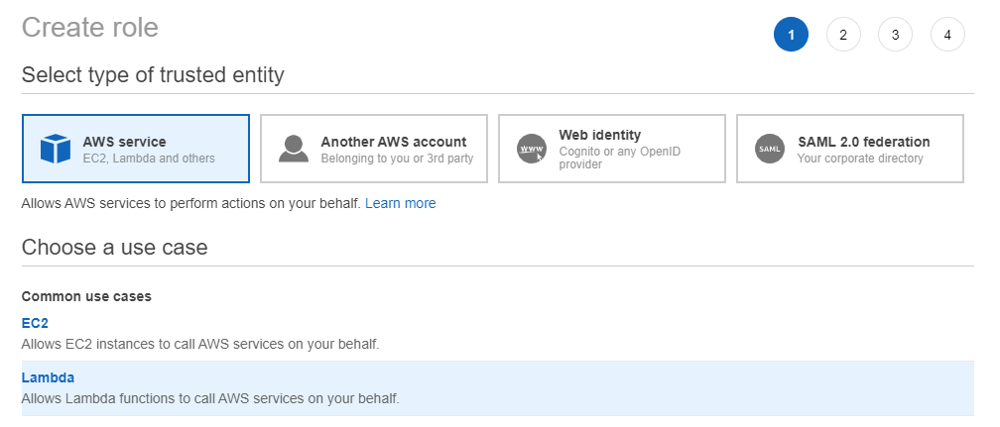

 After use case is selected, click next to setup permissions.

#### Step 2 - Permissions
Each resource has various permissions (read, write, ...). These permissions are grouped into policies in order make assigning permissions easier. This screen show all policies which can be assigned to our role. If these policies doesn't fit our needs, we can always create custom one to fine-tune our requirements (this is not covered in this article).

As mentioned previously, let's say our lamda will read and delete messages. You always want to select policy which contains just the permissions you need, not more, not less.
Type *sqs* in policies filter to view possible policies. These policies should be listed:
- *AmazonSQSReadOnlyAccess* - Provides read only access to Amazon SQS via the AWS Management Console.
 - *AmazonSQSFullAccess* - Provides full access to Amazon SQS via the AWS Management Console.
- *AWSLambdaSQSQueueExecutionRole* - Provides receive message, delete message, and read attribute access to SQS queues, and write permissions to CloudWatch logs.

Ok, so let's find out which one of these permissions are best fit for us. *AmazonSQSReadOnlyAccess* doesn't satisfy our requirements as it doesn't permit deleting messages, *AmazonSQSFullAccess* gives full access to SQS resources which is much more than we need. Last, but not least - *AWSLambdaSQSQueueExecutionRole* is just what we need. After selecting this policy, we should click next.

 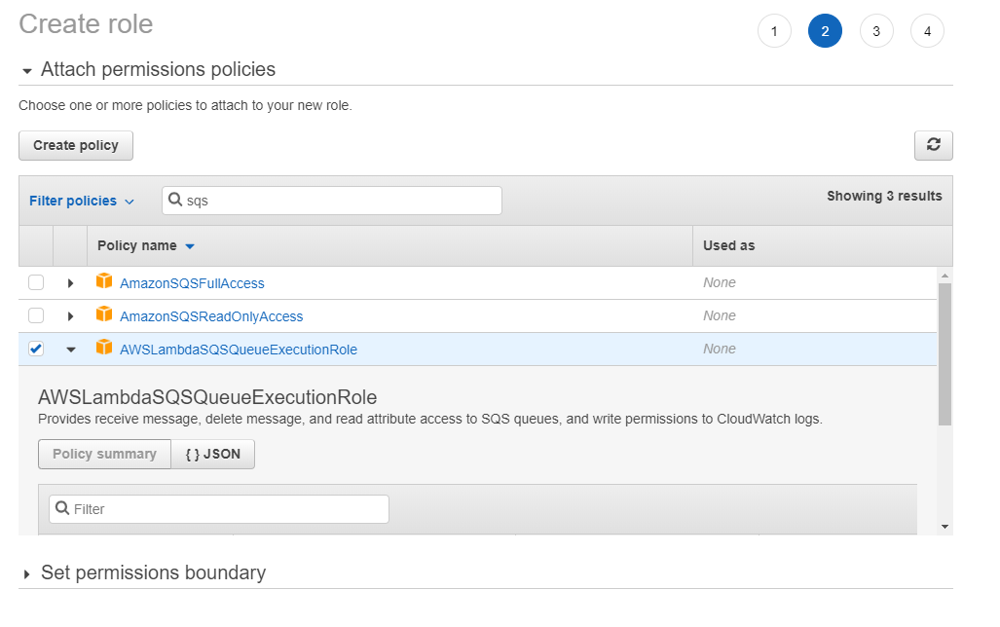
 
#### Step 3 - Tags
Tags serve as an easy way to add custom data to role, e.g. **department=development**. We can add zero or more tags to organize them as we see fit. In this case, we won't use any tags but if you want to learn more about them, make sure you [check out official docs](http://docs.aws.amazon.com/console/iam/roles-tagging).

Click next!

#### Step 4 - Review
All we have to do now is name our new role (*LambdaQueueExecution*), click *Create role* and voilà - our role is created!
 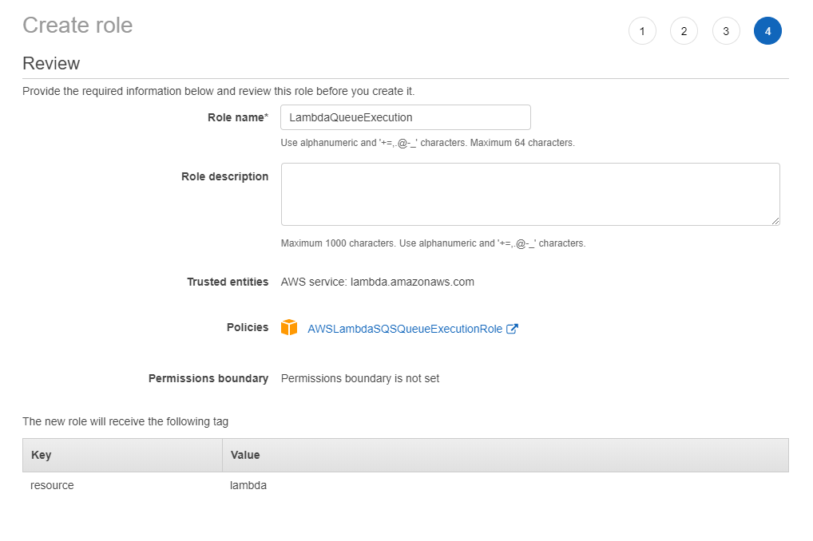

### Create Lambda
After preparing the role, we can finally create the Lambda itself. Move to [Lambda section in AWS console](https://console.aws.amazon.com/lambda) and click *Create function*.

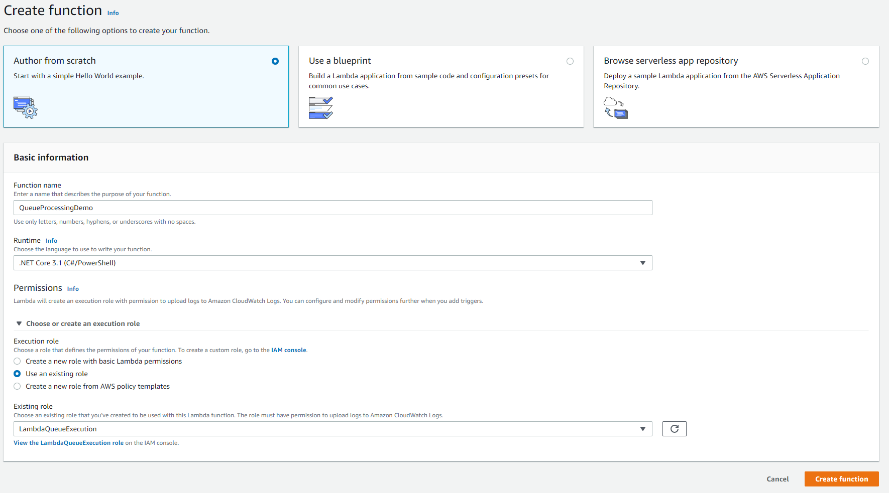

In order to make this work, you need to do following (as on screenshot above):
- define function name, in our case it's *QueueProcessingDemo*
- set runtime to .NET Core 3.1
- assign role we created previosly

That's it, after clicking *Create function* we're all done here.

### Create queue
Finally, last piece of our puzzle - creating queue. Move to [SQS section in AWS console](https://console.aws.amazon.com/sqs) and click *Create queue*.

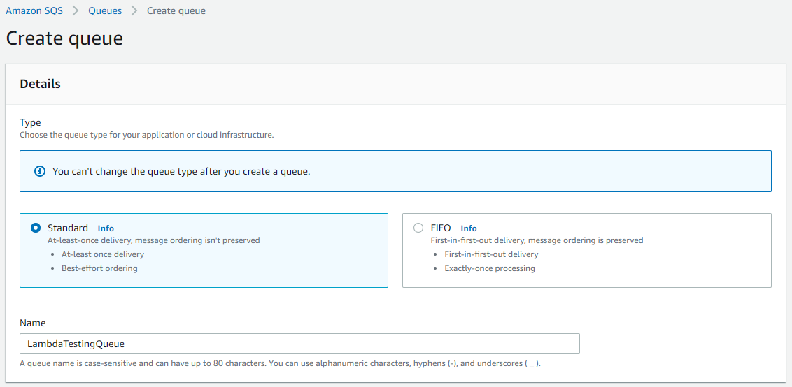

We'll use *Standard* queue here. Difference between *Standard* and *FIFO* (*First-in-first-out*) queue is that *FIFO* queue will deliver messages in order they were received and deliver them only once. On the other hand, *Standard* queue will deliver message at least once (there is possibility to deliver multiple time) and try to preserve order of messages. 

As you can see, *FIFO* is bit more sofisticated so another difference between them is price - *FIFO* is bit more expensive. At the time of writing this article, European prices were:
- Standard Queue - $0.40 per milion requests
- FIFO Queue - $0.50 per milion requests

So, if you're using queues to send e-mails - you'll want to go with *FIFO* as you want to eliminate possibility of sending the same e-mail multiple times. 

Besides queue type, we should set name to it - *LambdaTestingQueue*.

Click *Create queue* (this is the last time, I promise).

### Connect queue and lambda
Last thing we need to do is configure our newly created queue to trigger function when new message arrives.

To do this, navigate to queue we created. In bottom section of the screen click on *Lambda triggers* tab and then on *Configure Lambda function trigger*.

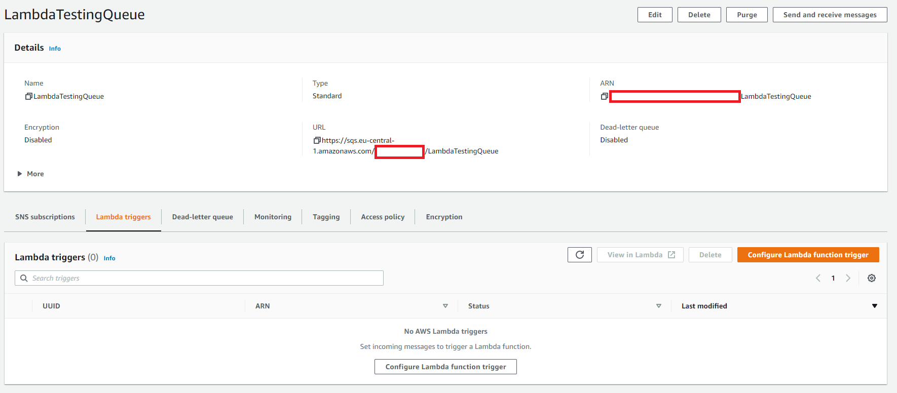

After the new screen loads, we have the last AWS step - select your Lambda function from dropdown and click *Save*. That's it, we're done!

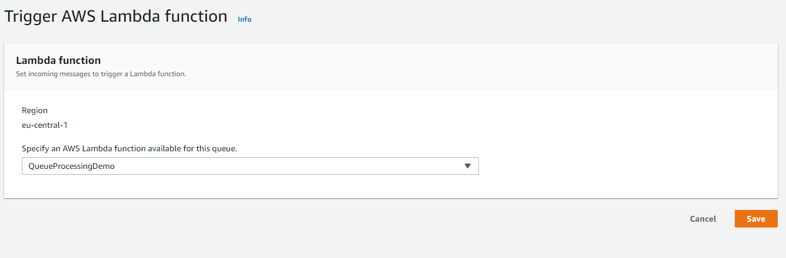

## Setup Visual Studio
To keep things friendly and simple, we'll do everything from UI. AWS has built extension for Visual Studio that includes various project templates and allow deploying to AWS from Visual Studio.

Visit [AWS Toolkit](https://aws.amazon.com/visualstudio/) page and download and install AWS Toolkit.

After the installation, we can finally move on to do some actual coding.


## Create new project and lambda function
### New project
Start the Visual Studio and open *Create new project* (either from splash screen or *File -> New -> Project*).

In templates list, look for (or search) for *AWS Lambda Project (.NET Core - C#)*, select it and click *Next*.

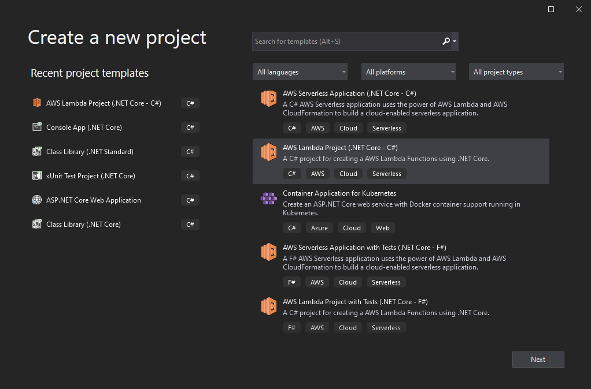

Now we need to give our new project and solution a name, so enter *LambdaQueueProcessor* as a project name and *AWSDemos* for solution name (or any other names you like).

Click *Create*!

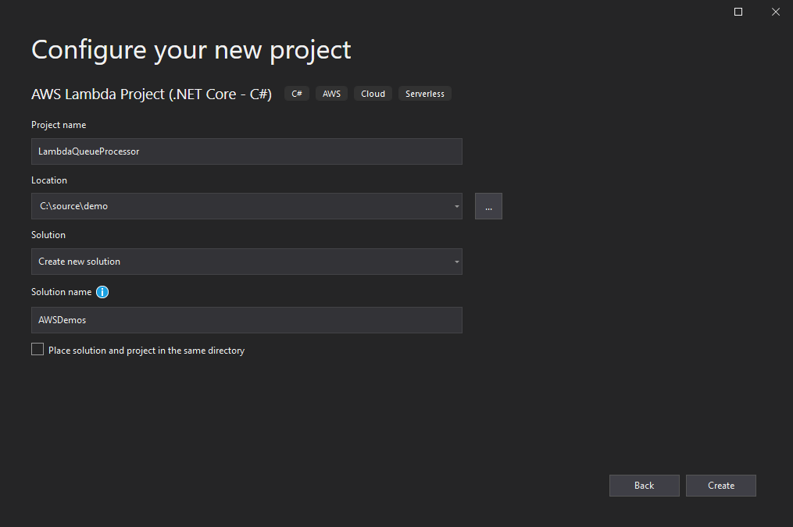

After clicking *Create*, window with various blueprints should show up. As you can see, AWS Toolkit already has many different templates you can use directly, even the one for processing Queue messages.

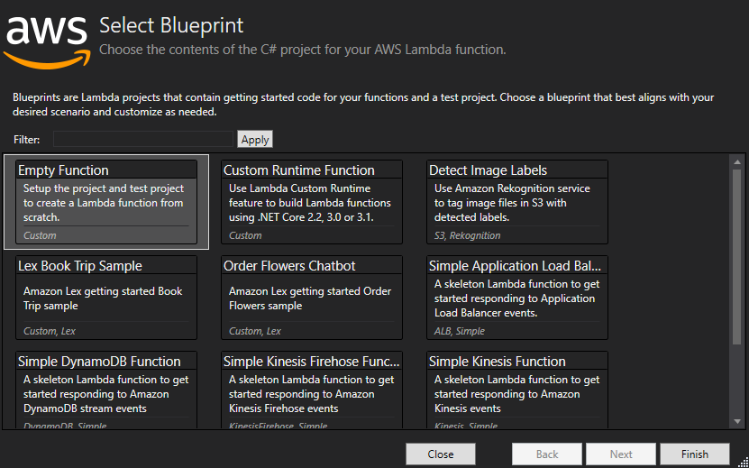

For this example, let's go (almost) from scratch and build our way up. Select *Empty function* template, press *Finish* and we're done with the new project setup!


### Empty function
Project will contain several files, but all we care about is *Function.cs* which contains actual code that'll run on function execution.

If you open up *Function.cs* it should contain something like:
```csharp
namespace LambdaQueueProcessor
{
    public class Function
    {
        public string FunctionHandler(string input, ILambdaContext context)
        {
            return input?.ToUpper();
        }
    }
}
```

So basicaly, we have simple class which contains single handler which is actually executed. Let's change this handler a bit and add some logging.
```csharp
public async Task FunctionHandler(object input, ILambdaContext context)
{
    context.Logger.LogLine($"Input string: {input}");
    await Task.CompletedTask;
}
```
Our handler will execute some task asynchronously in future so we want it to be async. Also, let's see what we actually get as an input which can be any kind of object. In order to check that out, first we need to deploy our code!

### Deploy to AWS Lambda
Before doing anything, we need to get security credentials which will be used to publish function, and determine region you're publishing it to.

#### Security credentials
To get new access key and secret, go to your [IAM Console here](https://console.aws.amazon.com/iam/home#/security_credentials) and under *Access keys (access key ID and secret access key)* section, press *Create new Access key*.

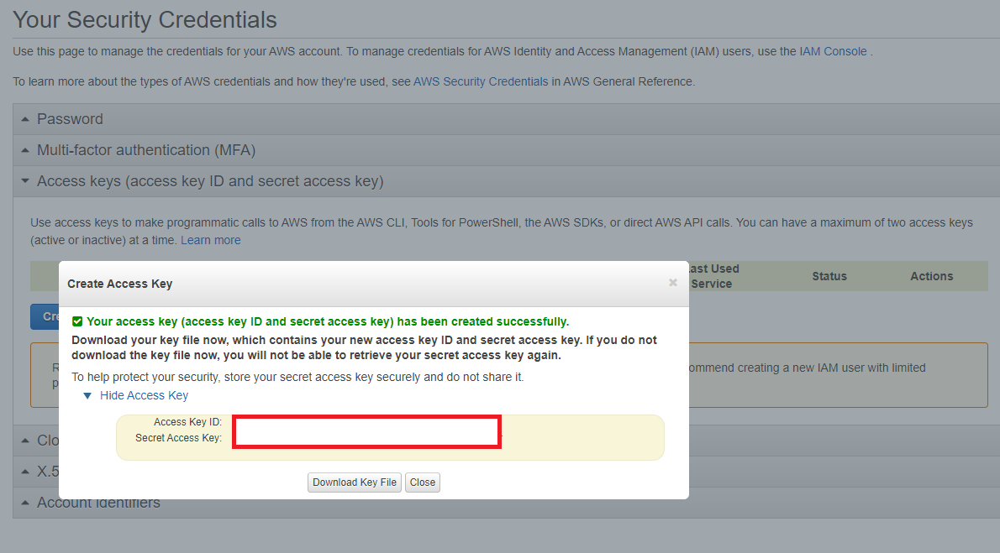

Download credentials as *csv* file or simple write them down as we'll need them later.

#### Region
To determine your region, open your [AWS management console](https://console.aws.amazon.com/lambda) and in top-right of the screen, you'll see the name of your region. Write this down as well.

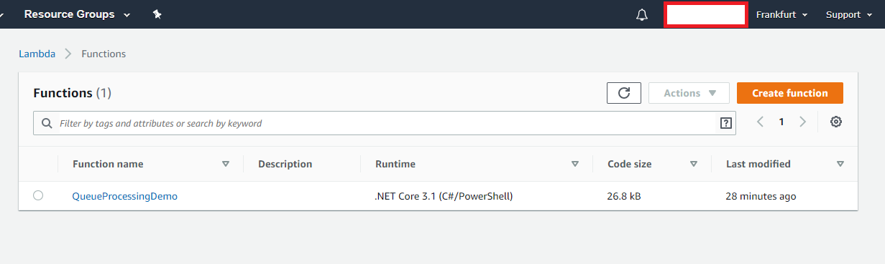

#### Deploy
In solution explorer, right-click on Function project and select *Publish to AWS Lambda...*

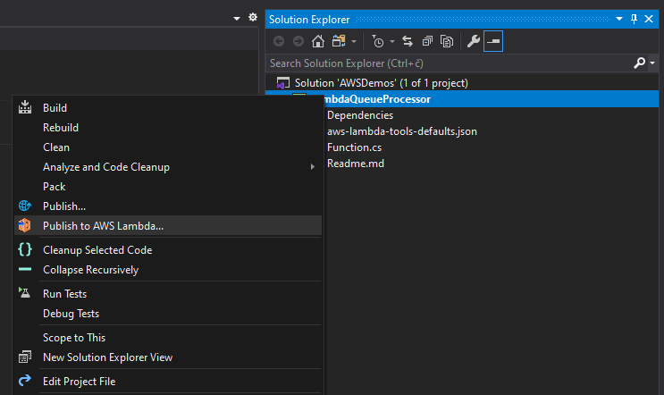

Next we need to setup our account, which should be done only once. To do this, click *Add another account* icon to show screen with required security credentials.

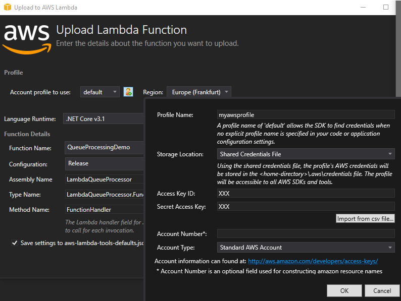

As a profile name, you can enter anything you like (e.g. myawsprofile). Now select region and enter security credentials you wrote down previously (or import credentials as CSV file).

Function name is Lambda we're deploying to (QueueProcessingDemo),assembly name is the name of your project (*LambdaQueueProcessor*), and type name is full path to your function class (*LambdaQueueProcessor.Function*).

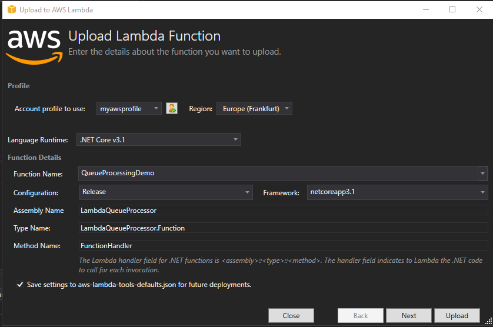

That's it, click upload and you're done!

#### Test
After deploying, new tab should open. This tab contains sample request to invoke youre function - select SQS from dropdown. This won't use the queue you created, but is enough to do our tests. 

Click *Invoke* and you should see nothing in response, but something should pop-up in log section.

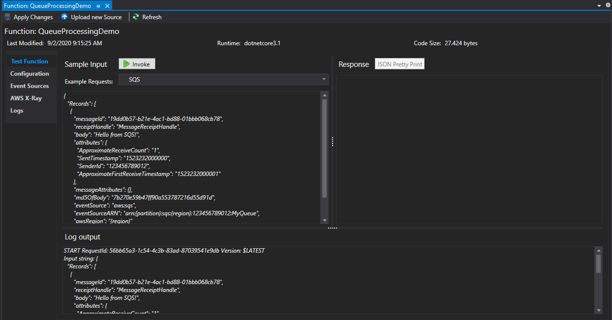

We logged entire object that was passed to function as raw string. This object contains list of all messages, and the message that was actually sent to queue was **Hello from SQS!**. The rest of the JSON contains data we don't care about at this point.

#### Better way to handle queue message
Instead of reading and logging raw object we know nothing about, let's use classes good guys from Amazon already prepared for this scenario.

First, add *Amazon.Lambda.SQSEvents* package to your project (right click on project in solution explorer -> Manage NuGet packages... -> search and install *Amazon.Lambda.SQSEvents*).

Now we can modify our function to do some (fictive) work and only log received message.

Entire function:
```csharp
using System.Threading.Tasks;

using Amazon.Lambda.Core;
using Amazon.Lambda.SQSEvents;

// Assembly attribute to enable the Lambda function's JSON input to be converted into a .NET class.
[assembly: LambdaSerializer(typeof(Amazon.Lambda.Serialization.SystemTextJson.DefaultLambdaJsonSerializer))]

namespace LambdaQueueProcessor
{
    public class Function
    {
        /// <summary>
        /// Process SQS Event
        /// </summary>
        public async Task FunctionHandler(SQSEvent evnt, ILambdaContext context)
        {
            foreach (var message in evnt.Records)
            {
                await ProcessMessageAsync(message, context);
            }
        }

        /// <summary>
        /// Process message from SQSEvent
        /// </summary>
        private async Task ProcessMessageAsync(SQSEvent.SQSMessage message, ILambdaContext context)
        {
            context.Logger.LogLine($"Processed message: {message.Body}");
            await Task.CompletedTask;
        }
    }
}
```

Now, deploy your function again and try to invoke it - only received message will be logged.

That's it, now you can expand your function to do some actual work.

#### Sending messages from actual queue
What if we actually want to test queue we created and see if everything went well?

Open [Management Console (SQS section)](https://console.aws.amazon.com/sqs), open queue you created and click *Send and receive messages* button.

Enter anything you want (let's say 'Hello from AWS Console') and click *Send message*. Ok, we've sent the message - but how do we know it was processed successfuly?

Open [Management Console (Lambda section)](https://console.aws.amazon.com/lambda), open Lambda you created and go to *Monitoring* tab. If you're interested in metrics, this is definitely the place to be. Hovewer, we want to check out logs so click on the *View logs in CloudWatch* button and after the screen loads *View in Logs Insights button*. 

This screen lets you query all logs, but all you have to do is click *Run query* to get everything logged by Lambda.

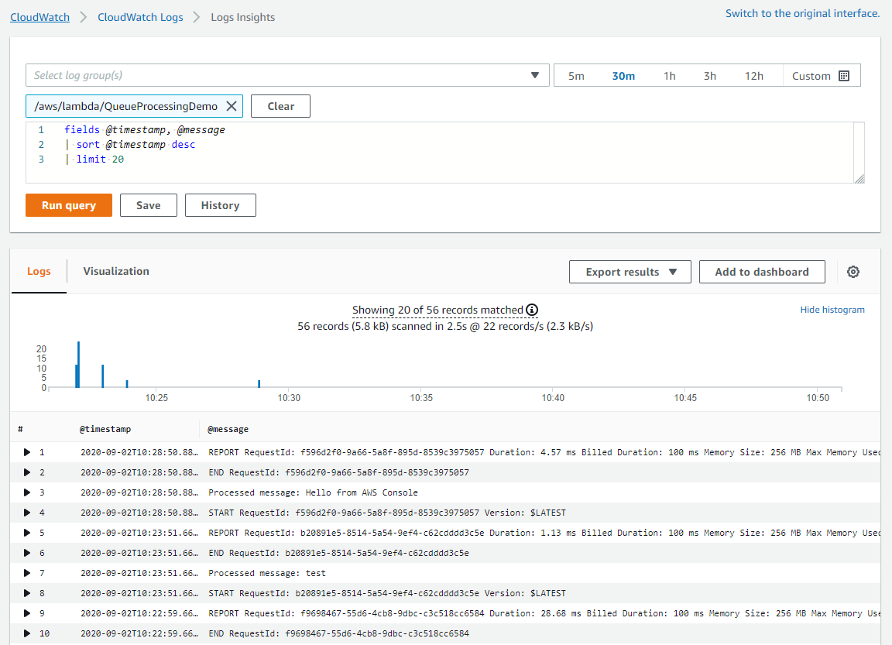

Near the top of the list, there should be message *Processed message: Hello from AWS Console*. That's it!

## What next?
Now you have all you need to get you going, so play with this code and try to do some actual work :)

Try building a mailing queue where your app can place e-mail as a message in the queue (to, subject, message) and send it using Lambda. Or, try to rember some process you worked on (or are working on) that could take the advantage of decoupling it and try to do it this way.

